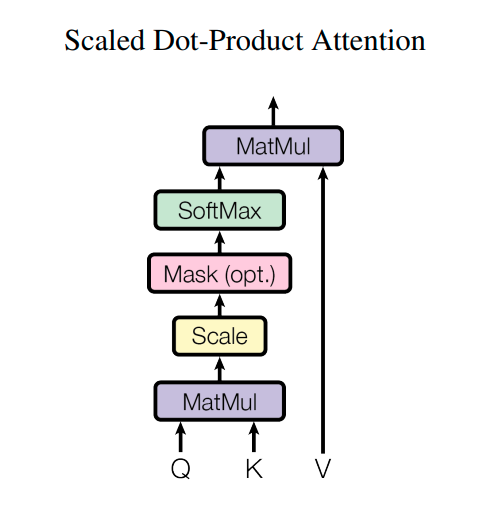
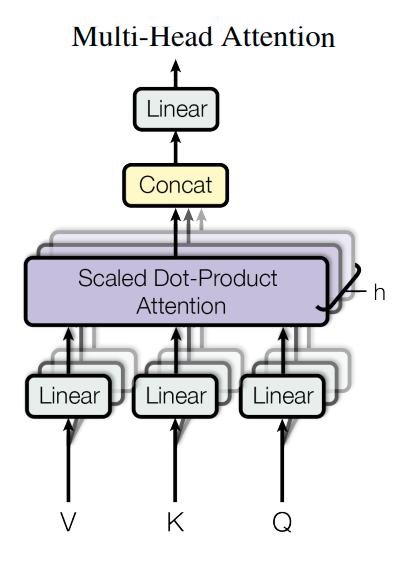
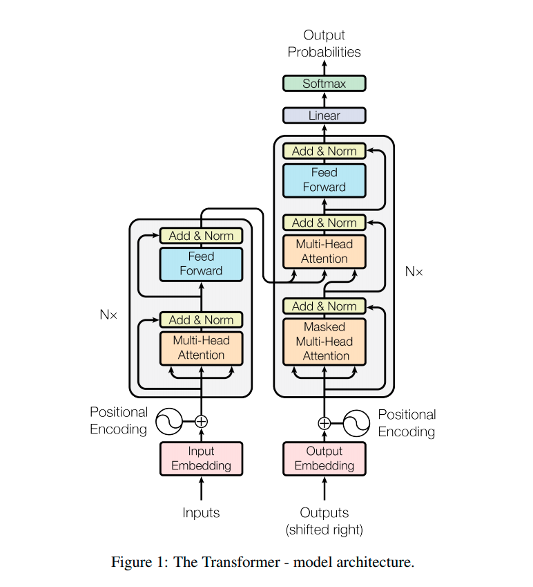
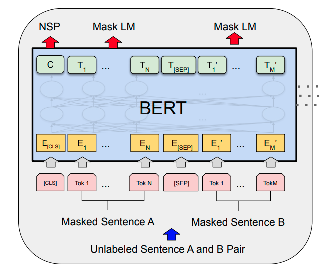
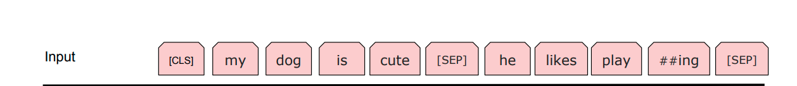

## 用Bert进行文本分类

by 魏福煊and谢天宝

### Transformer简介

我们已经非常熟悉lstm的结构及其优势。Lstm可以在训练的过程中照顾到前文的信息，使用双向biListm更可以同时读取到上下文的全部内容。然而Lstm有两个明显的缺陷：

- 需要严格按照序列顺序进行前向传播，依赖性比较严重，难以实现并行化
- 虽然相较于普通RNN，Lstm已经能够处理梯度消失的问题，但面对很长的数据时，还会暴露问题。

Transformer就出现啦！它既能实现并行化，又能照顾到上下文的信息。下面我们简要介绍一下Transformer的结构。

#### Scaled Dot-Product Attention

为了依然可以获取上下文有关的信息，我们用attention来取代RNN做这样的工作。Transformer的attention结构以及公式如下所示：




$$
Attention(Q,K, V) = softmax(\frac {QK^T}{\sqrt{d_k}})V
$$
这个模块的作用是，算出第i个单词位置的输出值。根据attention的基本原理我们知道， attention机制会计算单词 i 各个位置 j 的注意力值 a~ij~，利用加权和算出该位置的输出。本部分中， Q是由第i个位置的单词经过线性变换得到的，K是由j单词线性变换得到的。QK之间的运算相当于在计算a~ij~。V是由第j个单词线性变换得到，相当于是初始输出。因此最终得到了加权输出。

我们可以发现，相较于传统attention，该模块运用了较多的线性运算，从而加强了模块的能力。再加上实际应用中，往往需要多个Attention模块组合在一起（Multi-Head Attention），每个模块学习不同的内容，大大提高了模型的能力。



我们可以发现，每个位置attention的计算都可以独立完成且都是矩阵乘法，可以高度并行化。


聪明的你或许会发现，每个attention模块的计算似乎和位置没什么关系，不管其他单词在哪个位置，计算的输出都不会发生变化。其实在模型中，各个单词不仅仅包括自己的embedding，还包括纪录位置的信息。这个位置信息是由人手工设定的。

#### transformer模型架构




左面的部分相当于encoder，它由若干层Multi-Head Attention组成，而右边的部分相当于decoder。整体来看就像是把RNN的seq2seq模型换成了self attention 模块。


### Bert：Pre-training of Deep Bidirectional Transformers for Language Understanding

Bert强大到令人发质。刷新了多项NLP任务的baseline。

Bert本质上是一个预训练的适合于Fine-tuning的模型。在它的基础上套上一个分类器，再进行少量数据的训练就可以达到分厂好的效果，实现一个效果优秀的文本分类模型。Bert可以完成文本分类，序列标注、QA等等下游任务。我们先介绍Bert的基本结构，再介绍如何实现文本分类。


#### Bert结构

正如其名字所言，bert的结构是一个深层的transformer。



bert支持输入多个句子：在输入开头增加一个[cls]token，在每个句子结尾增加一个[SEP]token来区分句子。




#### Bert 无监督与训练

1. Mask LM：bert读入一段话，随机将一些单词替换为[mask]，让模型取预测原本的单词。由于使用时并不存在[mask]这个token，为了避免[mask]影响训练和实际应用的分布，不仅会把单词替换为mask，还会随机替换成别的单词。感兴趣的同学请参阅原论文。
2. NSP： 预测下一个句子。

利用这两种方式对Bert进行预训练。


#### Bert与文本分类：

针对文本分类，bert要求对[cls]位置的输出添加全连接神经网络进行fine tune。


### Bert文本分类实战

目前pytorch版本的bert使用最多的应该是[transformers库](https://huggingface.co/transformers/index.html)，大家可以详细阅读官方文档进行学习。本部分主要是开个小头，帮助大家捋顺transformers的基本用法。


##### 数据获取

这部分是从文件提取SST-2数据的代码，大家可以简单看看

``` python
from transformers import *
import csv
import torch
from torch.utils.data.dataset import Dataset
from torch.utils.data.dataloader import DataLoader
from tqdm import tqdm
import numpy as np
class DataIOSST2(object):
    def __init__(self, config):
        self.path = config['path']
        self.batch_size = config['batch_size']
        self.train_word, self.train_label, \
        self.dev_word, self.dev_label, \
        self.test_word, \
        self.test_label = self.read_train_dev_test()

    def read_train_dev_test(self):
        train_word, train_label = self.read_data(self.path + '/train.tsv')
        dev_word, dev_label = self.read_data(self.path + '/dev.tsv')
        test_word, test_label = self.read_data(self.path + '/test.tsv')
        return train_word, train_label, dev_word, dev_label, test_word, test_label

    @staticmethod
    def read_data(path):
        data = []
        label = []
        csv.register_dialect('my', delimiter='\t', quoting=csv.QUOTE_ALL)
        with open(path) as tsvfile:
            file_list = csv.reader(tsvfile, "my")
            first = True
            for line in file_list:
                if first:
                    first = False
                    continue
                data.append(line[1])
                label.append(int(line[0]))
        csv.unregister_dialect('my')
        return data, label
```

由于transformers自带 句子转化为id的功能，因此这里的dataset存储的是字符串！

``` python
class SSTDataset(Dataset):
    def __init__(self, sentences, labels):
        self.dataset = sentences
        self.labels = labels

    def __getitem__(self, item):
        return self.dataset[item], self.labels[item]

    def __len__(self):
        return len(self.dataset)

dataset = DataIOSST2({'path': '../MLP/data/SST-2', 'batch_size': 16})
```

这里获取了不同的数据集train、dev、test

```python
train_set = SSTDataset(dataset.train_word, dataset.train_label)
train_loader = DataLoader(train_set, shuffle=True, batch_size=16)
train_eval_loader = DataLoader(train_set, shuffle=False, batch_size=16)

dev_set = SSTDataset(dataset.dev_word, dataset.dev_label)
dev_eval_loader = DataLoader(dev_set, shuffle=False, batch_size=16)

test_set = SSTDataset(dataset.test_word, dataset.test_label)
test_eval_loader = DataLoader(test_set, shuffle=False, batch_size=16)
```


##### 模型搭建+optimizer选择

```python
tokenizer = BertTokenizer.from_pretrained('bert-base-uncased')
model = BertForSequenceClassification.from_pretrained('bert-base-uncased', num_labels=2, hidden_dropout_prob=0.3)
model.cuda(device=0)
optimizer = transformers.AdamW(model.parameters(), lr=2e-5)
```

这里介绍一下transformers库的两大元素，Tokenizer和Model。

- Tokenizer负责将一个字符串句子添加之前提到的[cls] [sep]， 以及转化为对应的id，形成Tensor。还支持默认的padding！
- Model：各种预训练模型可供选择，但要注意一些参数在pycharm中不会自动提示（源代码实现方式问题）

分别利用from_pretrained方法可以从网上下载预训练完成的模型。


##### 训练代码

```python
def train():
    loss = 0.0
    print('epoch', epoch + 1)
    model.train()
    for x, y in tqdm(train_loader):
        inputs = tokenizer(x, return_tensors='pt', padding=True)
        labels = y
        for w in inputs:
            inputs[w] = inputs[w].cuda(device=0)
        labels = labels.cuda(device=0)
        out = model(**inputs, labels=labels)
        out[0].backward()
        optimizer.step()
        loss += out[0].item()
        optimizer.zero_grad()
    print(loss / len(train_loader))
```

这里要注意，经过tokenizer后的input是一个元组，记载了model需要的各项信息，直接喂给model即可。model在提供labels时会自动计算损失，不需要自己定义。

model的输出是（损失， 全连接后的输出Tensor）。 不提供labels则就是全连接后的输出Tensor


##### 测试代码：

```python
def test(loader, data_set_name):
    with torch.no_grad():
        model.eval()
        correct = 0
        total = 0
        for x, y in tqdm(loader):
            inputs = tokenizer(x, return_tensors='pt', padding=True)
            labels = y
            for w in inputs:
                inputs[w] = inputs[w].cuda(device=0)
            labels = labels.cuda(device=0)
            out = model(**inputs)
            pred = torch.argmax(out, dim=-1, keepdim=False)
            pred = pred.cpu().numpy()
            labels = labels.cpu().numpy()
            correct += np.sum(pred == labels)
            total += pred.shape[0]
        print(data_set_name, correct / total)
```

异曲同工，注意这里面只需要喂给model inputs， 不需要给labels，因为不用算loss


可以参考我的github[https://github.com/awake020/pytorch_Bert_sst2](https://github.com/awake020/pytorch_Bert_sst2)